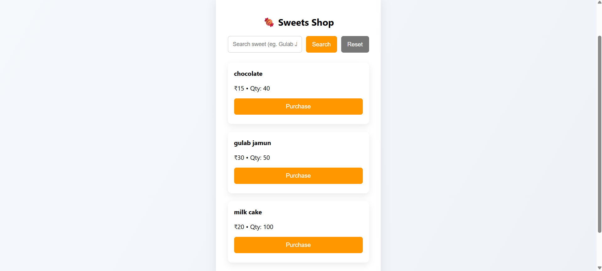

# 🍬 Sweet Shop Management System

A full-stack Sweet Shop Management System built using **Node.js (TypeScript), Express, MongoDB, and React**, following **Test-Driven Development (TDD)** principles and modern development practices.

This application allows users to register, log in, browse sweets, purchase items, and for **admin users** to manage inventory securely.

---

## 🚀 Live Application

* **Frontend (Vercel):**
  👉 [https://sweet-shop-management-system-imy5.vercel.app/](https://sweet-shop-management-system-imy5.vercel.app/)

* **Backend (Render):**
  👉 [https://sweet-shop-management-system-backend-9t7v.onrender.com/](https://sweet-shop-management-system-backend-9t7v.onrender.com/)

---

## 📸 Screenshots

### 🔐 Login Page


---

### 📝 Register Page


---

### 🍬 Sweets Dashboard (User View)


---

### 🛡️ Admin Dashboard


## 🛠️ Tech Stack

### Backend

* Node.js + TypeScript
* Express.js
* MongoDB Atlas + Mongoose
* JWT Authentication
* Jest + Supertest (TDD)
* Render (Deployment)

### Frontend

* React + TypeScript
* React Router
* Axios
* Vercel (Deployment)
* Custom CSS

---

## ✨ Features

### 👤 Authentication

* User registration & login
* JWT-based authentication
* Role-based access control (User / Admin)

### 🍭 Sweets Management

* View all sweets
* Search sweets by name, category, or price range
* Purchase sweets (quantity decreases)
* Out-of-stock protection

### 🛡️ Admin-Only Features

* Add new sweets
* Update sweet price & quantity
* Restock sweets
* Delete sweets
* Admin dashboard access protected on both frontend & backend

### 🧪 Testing (TDD)

* Auth API tests
* Sweets API tests
* Inventory tests
* Jest test suite with passing results

---

## 🔐 API Endpoints

### Auth

```
POST   /api/auth/register
POST   /api/auth/login
```

### Sweets (Protected)

```
POST   /api/sweets
GET    /api/sweets
GET    /api/sweets/search
PUT    /api/sweets/:id
DELETE /api/sweets/:id   (Admin only)
```

### Inventory (Protected)

```
POST /api/sweets/:id/purchase
POST /api/sweets/:id/restock   (Admin only)
```

---

## 📦 Database Schema

Each sweet contains:

* `id`
* `name` (unique)
* `category`
* `price`
* `quantity`
* timestamps

Duplicate sweets are prevented using:

* Mongoose unique index
* Case-insensitive validation
* Database cleanup scripts

---

## 🧑‍💻 Local Setup Instructions

### Backend Setup

```bash
cd backend
npm install
```

Create a `.env` file:

```env
MONGO_URI=mongodb+srv://<username>:<password>@cluster0.mongodb.net/sweet-shop-test
JWT_SECRET=supersecretkey
PORT=5000
```

Run backend:

```bash
npm run dev
```

Run tests:

```bash
npm test
```

---

### Frontend Setup

```bash
cd frontend
npm install
npm run dev
```

Update API base URL:

```ts
baseURL: "https://sweet-shop-management-system-backend-9t7v.onrender.com/api"
```

---

## 🧪 Test Report

All backend tests pass successfully:

* Auth tests ✅
* Sweets CRUD tests ✅
* Inventory tests ✅
* Admin permission tests ✅

Testing was done using **Jest + Supertest** following TDD principles.

---

## 🤖 My AI Usage

### AI Tools Used

* **ChatGPT**

### How AI Was Used

* Generating initial API boilerplate
* Writing Jest test cases
* Debugging MongoDB & deployment issues
* Improving search logic & validation
* Refactoring frontend components
* Writing README documentation

### Reflection

AI significantly improved development speed and debugging efficiency.
However, all logic decisions, architecture design, and final implementations were **manually reviewed, modified, and validated** to ensure correctness and originality.

AI was used as a **developer assistant**, not a replacement.

---

## 🧾 Git & Development Practices

* Frequent commits with meaningful messages
* TDD (Red → Green → Refactor)
* Clean code & modular structure
* Role-based authorization enforced at API level
* Secure environment variable handling

---

## 🎯 Final Notes

This project demonstrates:

* Full-stack development skills
* Secure authentication & authorization
* Test-driven backend development
* Clean architecture & deployment
* Responsible and transparent AI usage

---
